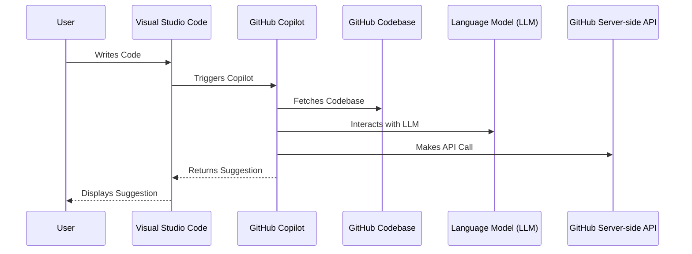

Table of Contents

* [Summary](#summary)
* [What is Copilot?](#what-is-copilot)
* [How to use Copilot](#how-to-use-copilot)
* [How to use Copilot with a new code base](#how-to-use-copilot-with-a-new-code-base)
* [Copilot Architecture in Mermaid Format](#copilot-architecture-in-mermaid-format)

# Summary

Here we will let Copilot generate a Copilot Overview by providing some simple prompts. The sections in this document will be:

* [What is Copilot?](#what-is-copilot)
* [How to use Copilot](#how-to-use-copilot)
* [How to use Copilot with a new code base](#how-to-use-copilot-with-a-new-code-base)

... and Copilot may suggest some other tips. We'll also add a section on Copilot Architecture in Mermaid Format.

## What is Copilot?

Copilot is a tool that helps you understand code.  It does this by using machine learning to generate a summary of the code you are looking at.  Copilot can be used to generate summaries of code you are looking at, or to generate summaries of code you are not looking at.  Copilot can also be used to generate summaries of code you are not looking at, but that you are interested in.

## How to use Copilot

To use Copilot, you need to have a code base that you are interested in.  You can use Copilot with any code base, but it is best to use Copilot with a code base that you are interested in.  If you are interested in a code base, you can use Copilot to generate a summary of the code base.  If you are not interested in a code base, you can use Copilot to generate a summary of the code base.

When checking out a new code base, CoPilot will primarily focus on the selected editor window and then use any open files are supplemental input.   If you have a file open that is not in the same directory as the selected editor window, CoPilot will not be able to use that file as input.  If you have a file open that is in the same directory as the selected editor window, CoPilot will use that file as input.  If you have multiple files open that are in the same directory as the selected editor window, CoPilot will use all of those files as input.

## How to use Copilot with a new code base

When checking out a new code base, CoPilot will primarily focus on the selected editor window and then use any open files are supplemental input.   If you have a file open that is not in the same directory as the selected editor window, CoPilot will not be able to use that file as input.  If you have a file open that is in the same directory as the selected editor window, CoPilot will use that file as input.  If you have multiple files open that are in the same directory as the selected editor window, CoPilot will use all of those files as input.

## Copilot Architecture in Mermaid Format

This one will require a prompt:

`Create a network timing diagram in Mermaid format for how Github Copilot works. Include Github Copilot, Github Codebase, Language Model, and Github Server-side API.`

# Some additional Copilot references on the web

* [Copilot on Github](https://github.com/features/copilot)
* [Copilot on Twitter](https://twitter.com/githubcopilot)
* [Copilot on Youtube](https://www.youtube.com/watch?v=9l7NzDwQDjw)
* [Copilot on Reddit](https://www.reddit.com/r/github/comments/ou0q7j/github_copilot/)
* [Copilot on Hacker News](https://news.ycombinator.com/item?id=27738444)
* [Copilot on TechCrunch](https://techcrunch.com/2021/06/29/github-launches-copilot-a-technical-co-pilot-for-programmers/)
* [Copilot on The Verge](https://www.theverge.com/2021/6/29/22555092/github-copilot-ai-pair-programming-tool-openai-codex)
* [Copilot on The Register](https://www.theregister.com/2021/06/29/github_copilot/)
* [Copilot on VentureBeat](https://venturebeat.com/2021/06/29/github-copilot-uses-ai-to-help-developers-write-code/)
* [Copilot on ZDNet](https://www.zdnet.com/article/github-copilot-ai-pairs-programmers-with-their-perfect-code-companion/)

