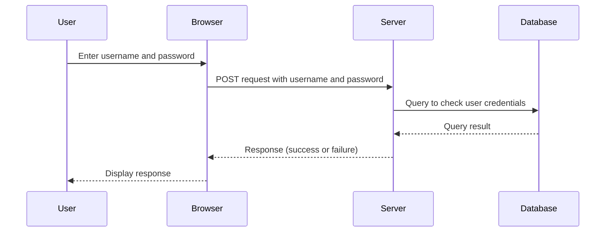
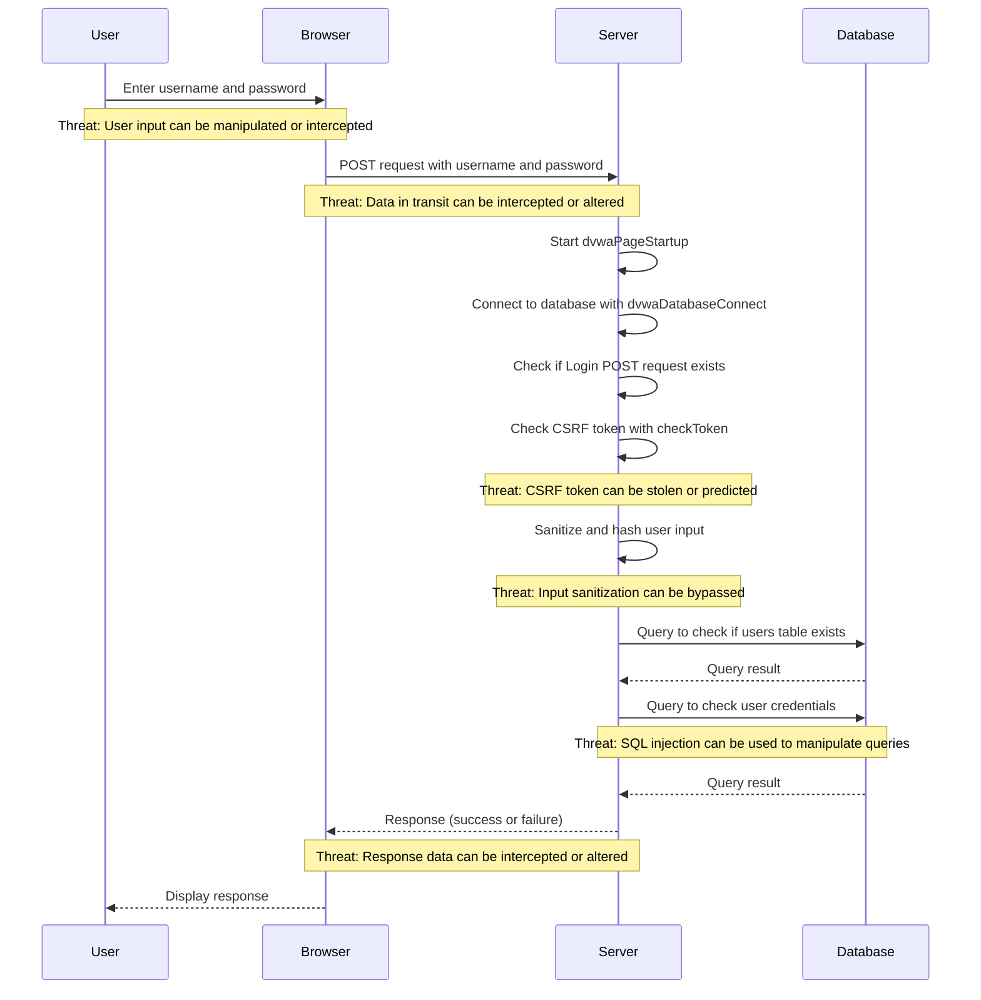

When checking out a new code base, CoPilot will primarily focus on the selected editor window and then use any open files are supplemental input.

## How to use Copilot with a new code base

When checking out a new code base, CoPilot will primarily focus on the selected editor window and then use any open files are supplemental input.   If you have a file open that is not in the same directory as the selected editor window, CoPilot will not be able to use that file as input.  If you have a file open that is in the same directory as the selected editor window, CoPilot will use that file as input.  If you have multiple files open that are in the same directory as the selected editor window, CoPilot will use all of those files as input.

## Using @workrspace in the chat

@workspace - Ask a question about the files in your current workspace

When asking questions about large code bases, it's helpful to break up questions about code in smaller modules.
Eg: front end, styles, API, databases, authentication flows, or specific business logic.

## Example:

Check out the DVWA: https://github.com/digininja/DVWA

Open up file: `login.php`

### Prompts to try:

* `Explaining the code in login.php`
* `Create a network timing diagram in mermaid format`. Sometimes you have to really tell it to give more detail, such as `create a network timing diagram for login.php. be as detailed as you can`

* `Update the diagram with a treat modeling assessment`

* `Provide a threat assessment in STRIDE format`

STRIDE is a threat modeling methodology developed by Microsoft. It's an acronym for Spoofing, Tampering, Repudiation, Information Disclosure, Denial of Service, and Elevation of Privilege. Here's a threat assessment for the provided login.php code in STRIDE format:

Spoofing: The application does not seem to implement any form of user authentication before the login process. An attacker could potentially spoof another user's identity if they can guess or steal their credentials.

Tampering: The application uses mysqli_real_escape_string to sanitize user input, which can help prevent SQL injection attacks. However, if this function is not used correctly, an attacker could potentially tamper with the SQL queries to manipulate the application's data.

Repudiation: The application does not seem to implement any form of logging for the login process. This means that if an attacker were to perform malicious actions, there would be no way to trace those actions back to them.

Information Disclosure: The application uses MD5 to hash passwords, which is considered insecure due to its vulnerability to collision attacks. If an attacker were to gain access to the hashed passwords, they could potentially reverse-engineer them to obtain the original passwords.

Denial of Service: The application does not seem to implement any form of rate limiting for the login process. This means that an attacker could potentially perform a brute force attack to guess a user's password, which could lead to a denial of service.

Elevation of Privilege: The application does not seem to implement any form of role-based access control. This means that once a user is logged in, they may have access to all of the application's functionality, potentially allowing for an elevation of privilege attack.

Please note that this is a high-level assessment based on the provided code. A more thorough assessment would require a full review of the application's codebase and architecture.

* `@workspace create a system architecture diagram in mermaid format`

Here we get a bit more limited. As you start to open more files and explain them, Copilot will get a bit smarter and helping you understand your codebase. However, Copilot is still primarily what's focused on what's in front of it: highlighted code, active code tab, open tabs, and other files in the same directory.

# References

* Github Copilot for *YOUR* Codebase: https://githubnext.com/projects/copilot-view/
* @workspace quick summary: https://www.youtube.com/watch?v=iXG1J8a2RE4
* STRIDE: https://docs.microsoft.com/en-us/azure/security/develop/threat-modeling-tool-threats
* Threat Modeling (OWASP): https://owasp.org/www-community/Application_Threat_Modeling

