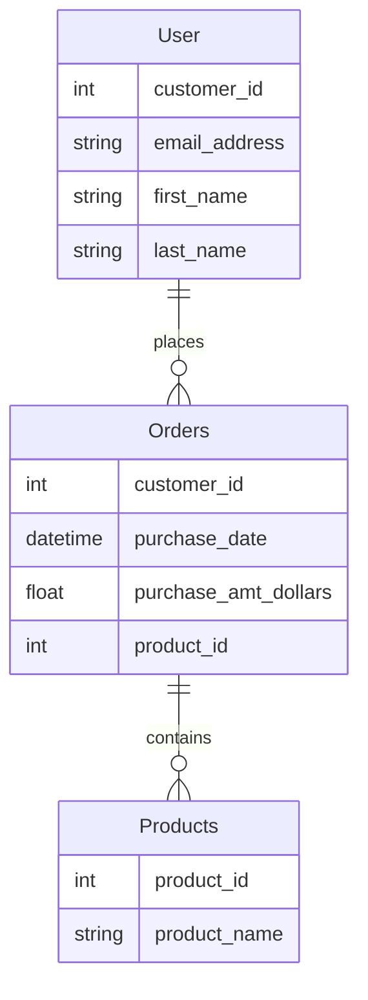

# Summary

The focus of this module is to show you can craft SQL on a (sqlite3) DB with multiple tables. The script to create fake data and DB are already pre-created. However, Copilot was used to generate that code as well. The sqlite3 database `test.db` has already been created in this directory.

# Pre-work

Here's the steps I took to get to a script that generates fake data. As a matter of requirements, I took the approach to design the back-end data first, then work toward the business logic. This is a common approach in the industry.

## Create an ERD from the table requirements.

Let's get a nice visualization and make sure we got our data model correct. Nothing else will matter if that's not right.

**Prompt**

```
Create me an ERD in mermaid format with the following requirements:

Table called User with fields:
    eamil_address - string
    first_name - string
    last_name - string
    customer_id (integer) - primary key 
Table called Orders:
    customer_id (integer) - primary key
    purchase_date (date-time)
    purchase_amt_dollars (float)
    proudct_id (integer) - foreign key 
Table called Products:
    product_id (primary_key, integer)
    product_name (string)

The customer has a one to many relationship to Orders with customer_id The Order table has a one to many relationship with Products with product_id
```

**Result**

Our relationship looks good and we have foreign key relationship we can join data on (customer_id and product_id).



# Generate fake data

Now that we have our data model, let's generate some fake data. We'll use a python library called Faker to do this. We'll also use a python library called sqlite3 to create our DB and insert the data. We need to be careful on the prompt here to clarify the range of values for the custom_id and product_ids so that joins will return results.

**Prompt**

```
create python code that will generate test data for all 3 databases. Create 10 rows in User, 50 rows in Orders, and 20 rows in products. generate the DB in the same directory as the script. User table customer_id must be unique with value from 1 to 20. The Orders table must only use customer_ids from 1 to 20 but can be duplicated.
```

**Result**

See [db-gen.py](./db-gen.py)


# Exploring the module

## Pre-requisites

Be sure to have `sqlite3` installed on the command line.

## Running the module

`sqlite3 testdb.db < <script name>`

Now we can explore how we can ask questions if fairly plain english to generate SQL to pull insights from the data. There are several scripts to explore in this module's folder.

